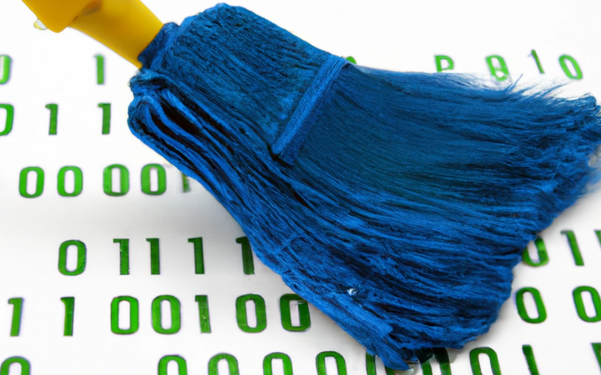

<p align="center">
  
</p>
<h1 align="center">packetSwiffer</h1>

## Introduction
**packetSwiffer** is a library that uses the rust `libpcap` library to capture packets on Windows, Linux and macOS.\
The library allows the user to capture packet on a user specified network adapter by setting it in promiscuous mode, and generates reports on the traffic observed after a specified time interval.\
The report is organized by source and destination port and address, and shows information about the number of bytes exchanged, the transport and application protocols and a time of first and last packet exchange.

## Usage
**NOTE**: The application needs to be run with admin priviledges in order to correctly use the specified interface to sniff traffic.

The application can be run with the following arguments:
```
Usage: swiffer [OPTIONS]
Options:                                                                                                                  
-t, --timeout <TIMEOUT>      Optional timeout for report generation (in seconds) [default: 10]                          
-f, --filename <FILENAME>    Optional filename for generated report (<filename>_<seq_num>.txt) [default: report]        
-i, --interface <INTERFACE>  Name of the interface to be used for the sniffing                                          
-p, --promisc                Set the interface in promiscuous mode                                                      
-l, --list                   Show the net interfaces present in the system without launching the sniffing  
    --csv                    Set report file type to csv instead of default txt
-h, --help                   Print help information                                                                     
-V, --version                Print version information 
```
You have to run the application with the `--interface` flag (to start the sniffing with the specified network interface id) **OR** with the `--list` one (in order to list the available network interfaces).

## Dependencies
- [pcap](https://docs.rs/pcap/0.10.1/pcap/index.html)
- [timer](https://docs.rs/timer/0.2.0/timer/)
- [pktparse](https://docs.rs/pktparse/0.7.1/pktparse/)
- [dns_parser](https://docs.rs/dns-parser/0.8.0/dns_parser/)
- [chrono](https://docs.rs/chrono/0.4.23/chrono/)
- [clap](https://docs.rs/clap/4.0.15/clap/index.html)
- [serde](https://docs.rs/serde/1.0.147/serde/)
- [csv](https://docs.rs/csv/1.1.6/csv/)

## Structs

- ### [Packet](./docs/struct/packet.md)
- ### [ReportHeader](./docs/struct/reportHeader.md)
- ### [ReportWriter](./docs/struct/reportWriter.md)
- ### [Report](./docs/struct/report.md)
- ### [Filter](./docs/struct/filter.md)
- ### [Settings](./docs/struct/settings.md)
- ### [Args](./docs/struct/args.md)

## Enum

- ### [Error](./docs/enum/error.md)
- ### [Reporter](./docs/enum/reporter.md)

## Functions

### menu.rs
* `pub fn print_index(settings: &Vec<String>) -> ()`: Print all index options.
* `pub fn menu() -> Settings`: Main dashboard. Here you can choose all different options and return a `Settings` struct.
* `pub fn filter_menu() -> () `: Print all filter options.
* `pub fn print_filter() -> Filter`: Dashboard where you can choose which filter you want to add. Return a `Filter` struct.
* `pub fn filter_ip_source() -> String`: Acquire source ip from I/O (keyboard).
* `pub fn filter_ip_dest() -> String`: Acquire destination ip from I/O (keyboard).
* `pub fn filter_port_source() -> String`: Acquire source port from I/O (keyboard).
* `pub fn filter_port_dest() -> String`: Acquire destination port from I/O (keyboard).
* `pub fn filter_transport_protocol() -> String`: Acquire transport protocol from I/O (keyboard).
* `pub fn parse_filter(filter: Filter) -> String`: Convert a `Filter` struct into a `String`.
* `pub fn check_transport_protocol(string: &String) -> bool`: Check if the user has correctly wrote the transport protocol. Written transport protocol must belong to this set: (**icmp**, **icmp6**, **igmp**, **igrp**, **pim**, **ah**, **esp**, **vrrp**, **udp**, **tcp**).
* `pub fn check_ip_address(string: &String) -> bool`: Check if the user has correctly wrote an ip address. 
* `pub fn check_port_number(string: &String) -> bool`: Check if the user has correctly wrote a port number. The port number must be between 0 and 65535.
* `pub fn set_timeout() -> i64`: Acquire timeout from I/O (keyboard).
* `pub fn set_filename() -> String`: Acquire the desidered name in which you want to save the report from I/O (keyboard).
* `pub fn print_interface() -> ()`: List all the available interfaces.


### parser.rs
* `fn handle_udp_packet(interface_name: &str, source: IpAddr, destination: IpAddr, packet: &[u8]) -> Result<Packet, Error>`: Manage UDP Packet
* `fn handle_icmp_packet(interface_name: &str, source: IpAddr, destination: IpAddr, packet: &[u8]) -> Result<Packet, Error>`: Manage ICMP Packet
* `fn handle_tcp_packet(interface_name: &str, source: IpAddr, destination: IpAddr, packet: &[u8]) -> Result<Packet, Error>`: Manage TCP Packet
* `fn handle_transport_protocol(interface_name: &str,source: IpAddr,destination: IpAddr,protocol: IPProtocol,packet: &[u8],) -> Result<Packet, Error>`: Recognize Transport Protocol
* `fn handle_ipv4_packet(interface_name: &str, packet: &[u8]) -> Result<Packet, Error> `: Manage IPv4 Packet
* `fn handle_ipv6_packet(interface_name: &str, packet: &[u8]) -> Result<Packet, Error> `: Manage IPv6 Packet
* `fn handle_arp_packet(interface_name: &str, packet: &[u8]) -> Result<Packet, Error> `: Manage ARP Packet
* `pub fn handle_ethernet_frame(interface: &Device, ethernet: &[u8]) -> Result<Packet, Error>`: Manage Ethernet frame

### report.rs
* `pub fn setup_directory(filename: &str) -> String`: create the directory with specified filename, adding a timestamp to the folder name
* `pub fn produce_hashmap(buffer: Vec<Packet>) -> HashMap<ReportHeader, Report>`: create the hashmap starting from a buffer of packets. Used when the Report structure are created

### utils.rs
* `pub fn mac_to_str(addr: MacAddress) -> String`: Convert a MAC Address as a String
* `pub fn tcp_l7(port: u16) -> String`: Recognize Application Layer of a TCP Packet
* `pub fn udp_l7(port: u16) -> String`: Recognize Application Layer of a UDP Packet

## Errors
Most public functions return a `Result`, the possible errors are the following:

* `NoSuchDevice`: No such network interface
* `ARPParsingError`: Error while parsing ARP Packet
* `ParsingError`: Error while parsing
* `UnknownPacket`: Unknown Packet
* `IPv6ParsingError`: Error while parsing IPv6 Packet
* `IPv4ParsingError`: Error while parsing IPv4 Packet
* `ICMPParsingError`: Error while parsing ICMP Packet
* `TCPParsingError`: Error while parsing TCP Packet
* `UDPParsingError`: Error while parsing UDP Packet
* `EthernetParsingError`: Error while parsing Ethernet Packet
